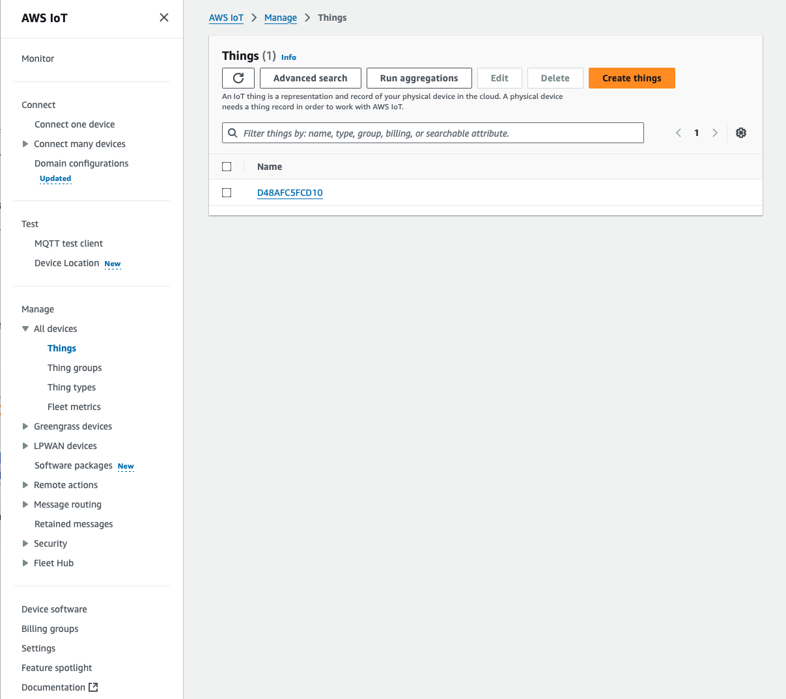
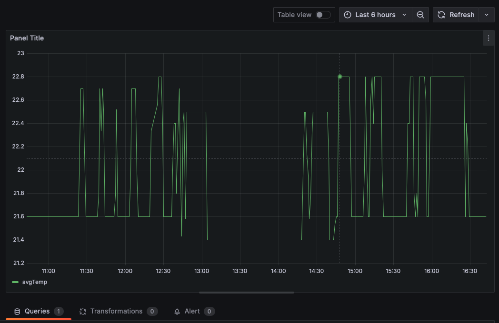

# IoT Sensor Data Visualization

## Introduction
This project collects temperature and humidity data using a DHT11 sensor connected to an ESP32. The data is sent to AWS IoT Core, stored in DynamoDB, and visualized using Grafana. Additionally, the system sends alerts to a Discord channel if thresholds for temperature or humidity are exceeded. DynamoDB data is periodically backed up to Amazon S3 for long-term storage and recovery.

## Features
- Collects real-time temperature and humidity data.
- Sends data securely using MQTT via AWS IoT Core.
- Stores data in DynamoDB for long-term use.
- Visualizes data with Grafana dashboards.
- Sends notifications to Discord for threshold breaches.
- Backs up DynamoDB data to Amazon S3 for additional redundancy.

## Scalability
The project leverages AWS services that are inherently scalable, ensuring the system can handle increased load as more devices or data points are added:

- **AWS IoT Core**: Supports millions of devices and messages, making it easy to scale horizontally without changes to the infrastructure.
- **DynamoDB**: Automatically scales to accommodate spikes in traffic with on-demand capacity mode. Global tables enable multi-region replication for low-latency access.
- **Amazon S3**: Provides virtually unlimited storage, ensuring long-term storage and redundancy as data grows.
- **AWS Lambda**: Scales automatically with the number of incoming requests, ensuring seamless processing of data and notifications.
- **CloudWatch**: Efficiently handles logs, metrics, and events from the system, providing real-time monitoring even with increasing devices.
- **Grafana**: Supports integration with scalable data sources like CloudWatch and DynamoDB, making it suitable for monitoring large-scale deployments.

This scalability ensures that the system is robust and future-proof, capable of handling additional devices, sensors, and users with minimal operational overhead.

## System Architecture

## Hardware Setup
### Components
- **ESP32**: Microcontroller for data collection and transmission.
- **DHT11 Sensor**: Measures temperature and humidity.

### Wiring Diagram

## Software Setup
### Arduino Code
The ESP32 is programmed using Arduino IDE to:
- Collect data from the DHT11 sensor.
- Send data to AWS IoT Core using MQTT.

### AWS IoT Core
1. Create a Thing in AWS IoT Core.
   
3. Attach certificates and a policy to the Thing.
4. Configure the ESP32 with the Thing’s credentials.

### DynamoDB and CloudWatch
- Data is stored in DynamoDB for retrieval and analysis.
- CloudWatch is used to log metrics and trigger Lambda functions.

### S3 Backup
- DynamoDB data is backed up to an S3 bucket for long-term storage and recovery. This ensures redundancy and facilitates data retrieval in case of accidental deletion or failure.

### Discord Notifications
- A Lambda function processes incoming telemetry and sends alerts to a Discord channel when thresholds are exceeded.

### Grafana Visualization
1. Use AWS CloudWatch or DynamoDB as the data source.
   
3. Create a dashboard to visualize temperature and humidity over time.
4. Example Dashboard:
   

## Results
The project successfully visualizes real-time sensor data, sends notifications, and backs up data. Below are examples:

### Grafana Dashboard

### Discord Notifications

## How to Run
1. **Set Up the Hardware**:
   - Connect the DHT11 sensor to the ESP32.
   - Upload the Arduino code.
2. **AWS IoT Core**:
   - Set up MQTT topics for telemetry.
3. **DynamoDB**:
   - Ensure the table is set up to store data.
4. **Amazon S3**:
   - Configure DynamoDB backup to S3 for redundancy.
5. **Grafana**:
   - Create a dashboard for visualization.
6. **Discord Notifications**:
   - Set up a webhook in Discord and update the Lambda function with the webhook URL.

## Future Improvements
- Add more sensors (e.g., light, motion).
- Implement advanced analytics on the collected data.

## Conclusion
This project demonstrates the successful integration of IoT hardware with cloud services to collect, transmit, store, and visualize sensor data while providing real-time notifications. With data backed up in Amazon S3, the system ensures redundancy and long-term storage, making it robust and scalable for future IoT developments.
