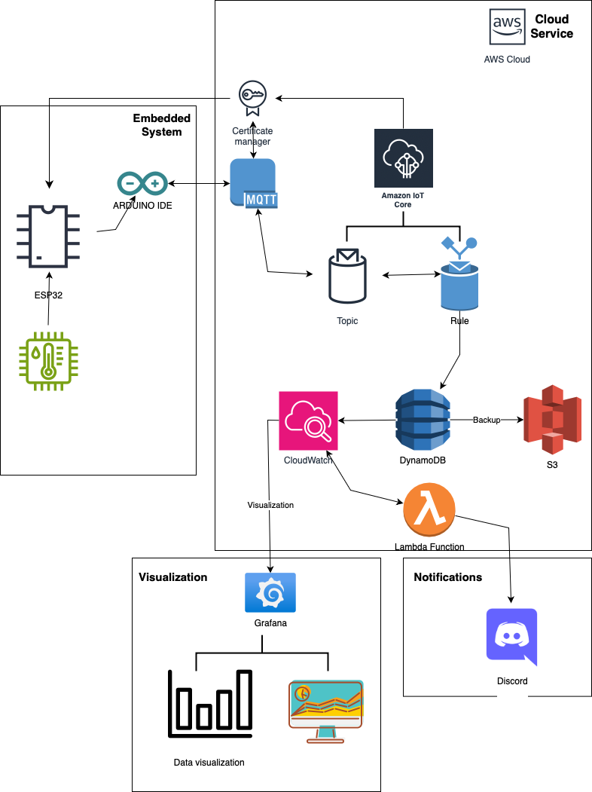

# IoT Sensor Data Visualization

## Introduction
This project collects temperature and humidity data using a DHT11 sensor connected to an ESP32. The data is sent to AWS IoT Core, stored in DynamoDB, and visualized using Grafana.

## Features
- Collects real-time temperature and humidity data.
- Sends data securely using MQTT via AWS IoT Core.
- Stores data in DynamoDB for long-term use.
- Visualizes data with Grafana dashboards.

## System Architecture

## Hardware Setup
### Components
- **ESP32**: Microcontroller for data collection and transmission.
- **DHT11 Sensor**: Measures temperature and humidity.
- **LEDs**: (Optional) For smart lighting simulation.

### Wiring Diagram

## Software Setup
### Arduino Code
The ESP32 is programmed using Arduino IDE to:
- Collect data from the DHT11 sensor.
- Send data to AWS IoT Core using MQTT.

### AWS IoT Core
1. Create a Thing in AWS IoT Core.
   
3. Attach certificates and a policy to the Thing.
4. Configure the ESP32 with the Thing’s credentials.

### Grafana Visualization
1. Use AWS CloudWatch or DynamoDB as the data source.
   
3. Create a dashboard to visualize temperature and humidity over time.
4. Example Dashboard:
   

## Results
The project successfully visualizes real-time sensor data. Below is a sample of the dashboard:

## How to Run
1. **Set Up the Hardware**:
   - Connect the DHT11 sensor to the ESP32.
   - Upload the Arduino code.
2. **AWS IoT Core**:
   - Set up MQTT topics for telemetry.
3. **DynamoDB**:
   - Ensure the table is set up to store data.
4. **Grafana**:
   - Create a dashboard for visualization.

## Future Improvements
- Add more sensors (e.g., light, motion).
- Implement smart lighting controls using AWS IoT Core.

## Conclusion

This project demonstrates the successful integration of IoT hardware with cloud services to collect, transmit, store, and visualize sensor data. The system is scalable and lays the groundwork for future IoT developments, such as adding more sensors or automation features.
